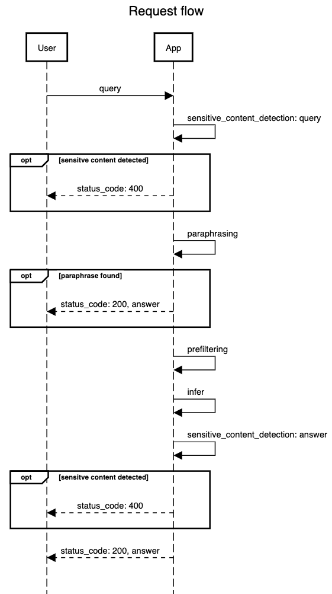

# CodeChallenge QA Service

<!-- TOC -->

- [CodeChallenge QA Service](#codechallenge-qa-service)
    - [Introduction](#introduction)
        - [outline](#outline)
        - [the repository](#the-repository)
            - [overview](#overview)
            - [usefull info](#usefull-info)
    - [The Task(s)](#the-tasks)
        - [Primary](#primary)
        - [Secondary](#secondary)
    - [setup & run](#setup--run)
        - [setup](#setup)
        - [run](#run)
        - [direct](#direct)
        - [via uvicorn](#via-uvicorn)

<!-- /TOC -->

## Introduction

**Welcome to the IU - Synthetic Teaching Coding Challenge.**

To get a bit of hands-on insight into your problem solving and coding skills we would like to give you a small tasks that you should be able to complete in a reasonable amount of time:

We do not want to occupy too much of your time, so please do not spend more than 2-4 hours on this task (but if you feel hyped, go ahead and code as long as you like 😉). If you identify multiple topics to work on, it might be better to focus on one and finish that in a clean way rather than implementing many hastily.

In the second interview, we would be happy to talk about your solution: You will have some time to explain your implementation and we would like to ask some related questions.

### outline

* duration: 2-4 hours
* provided: repository with a working python/fastapi application
* solution: please submit as a PR in a `feature/*` branch to this repo

### the repository

This repository contains a python FastAPI app (python>=3.9) with some middlewares, routes and various _mocked_ services.

#### overview

This app can receive a `query` from a user, find related documents ([prefiltering_service](src/codingchallenge_qa_service/services/prefiltering_service.py)) and generate a NL answer based on the prefiltered documents ([infer_service](src/codingchallenge_qa_service/services/infer_service.py)).
Furthermore, it does some paraphrase matching ([paraphrase_service](src/codingchallenge_qa_service/services/paraphrase_service.py)) and sensitive content detection ([sensitive_content_detection_service](src/codingchallenge_qa_service/services/sensitive_content_detection_service.py)).

Besides the main flow, it collects some meta information from variouse service and method calls (`input`, `ouput`, `duration`, etc.) and stores them inside
a [transaction](src/codingchallenge_qa_service/transaction.py) called object. This transaction will be stored at the end of a request triggered by a [middleware](src/codingchallenge_qa_service//middlewares/transaction_middleware.py) and the [transaction_service](src/codingchallenge_qa_service/services/transaction_service.py)

#### usefull info

* opening the `/docs` routes of the running service provides a openapi spec for routes and their request/response models
* be aware: for less complexity in the challenge code, **the response of the app is randomized**

---

## The Task(s)

_You are completely free to use `packages`, `tools` and `paradigms` of your choice.
The only requirements are:
It's still a `FastApi` application and all resulting functionality stays the same - the only exception is the model
of the resulting `transaction`, if you think it could be structured better (order, key names, etc.): feel free to adjust
this._

*The rest is up to you*

_Pick one or both_ 👇

### Primary

The way data is added to the transaction is quite cumbersome. The transaction is attached to the request via a middleware and needs to be passed to all methods which want to make use of it. Furthermore the duration measurement and adding of the data to the transaction is very repetitive. The main goal in this challenge is to improve this functionality so that it is easier to use.

### Secondary

If you could adjust this service to your vision, how would you restructure and refactor it?

---

## setup & run

### setup

- `pip install -e .`

### run

### direct

`python main.py`

### via uvicorn

`uvicorn codingchallenge_qa_service.app:create_app --reload --factory`

### build the image using docker
`docker build -t my-fastapi-app .`

`docker run -d -p 8000:8000 my-fastapi-app`

### run the tests within the container and provide the test results.
`docker build -t mytestimage -f Dockerfile.test .`

`docker run --rm mytestimage`